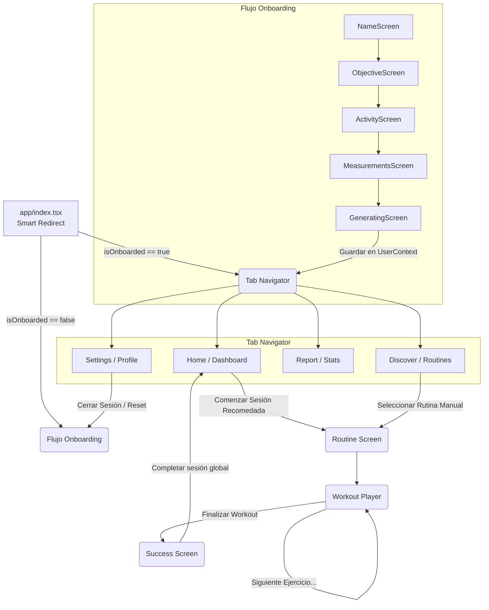
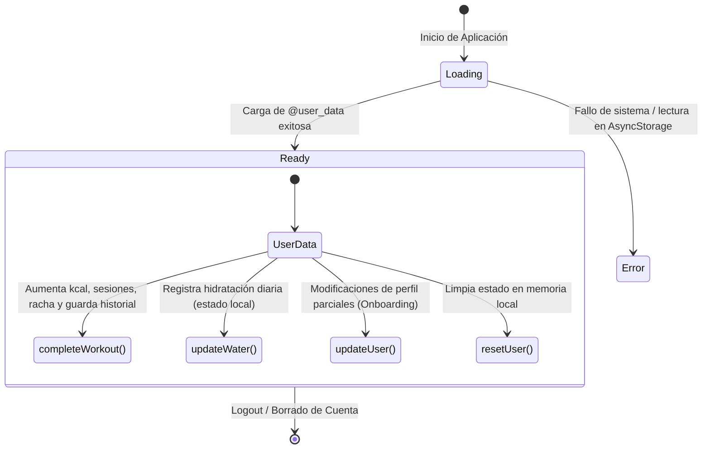

# Diagramas de Arquitectura y Navegación - GymTrack

Estos diagramas detallan la estructura interna de navegación y el flujo de estados manejado por la aplicación, útiles para la memoria escrita de tu Trabajo de Fin de Grado (TFC).

## 1. Diagrama de Navegación (Flujo Principal)

Este diagrama muestra cómo un usuario navega desde que abre la aplicación, incluyendo el enrutamiento inteligente (redirección) y el flujo interactivo de los entrenamientos.

## 2. Diagrama de Estado Global (UserContext con TS)

Este diagrama detalla cómo el contexto `UserContext` administra el estado global, persistiendo la información con `AsyncStorage` a lo largo del ciclo de vida de la aplicación de React Native. Se ha implementado un patrón de "Discriminated Union" para gestionar el estado estrictamente tipado.

---
*Generado para GymTrack - Carlota Rial.*
